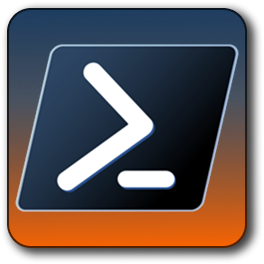

<!-- Header -->

  
  <h1>💻 PowerShell Profile</h1>

<!-- Content -->
# 1. Introduction

This repository contains PowerShell profile configuration and modules for my personal use. It is not intended for public use, but you may find some of the modules and functions useful as a reference or starting point for your own PowerShell setup.

> The profile is designed to be modular and reusable, with helper functions and modules.

# 2. Requirements

- [`PowerShell` `7.1+`][pwsh-install-link]
- `Nerd Fonts`
- `Windows Terminal` (or any terminal emulator of your choice)
- Modules:
  - `PSReadLine`
  - `Terminal-Icons`
  - `Oh-My-Posh`
  - `Fastfetch`

# 3. License

This repository is licensed under the `MIT` License. See the [LICENSE][repo-license-link] file for more details.

<!-- Footer -->
---

> © Cainã Carmo - 2026

  

<!-- Links -->
[pwsh-install-link]: https://learn.microsoft.com/en-us/powershell/scripting/install/install-powershell-on-windows
[repo-license-link]: https://github.com/CainCarmo/Powershell/blob/master/LICENSE.md
